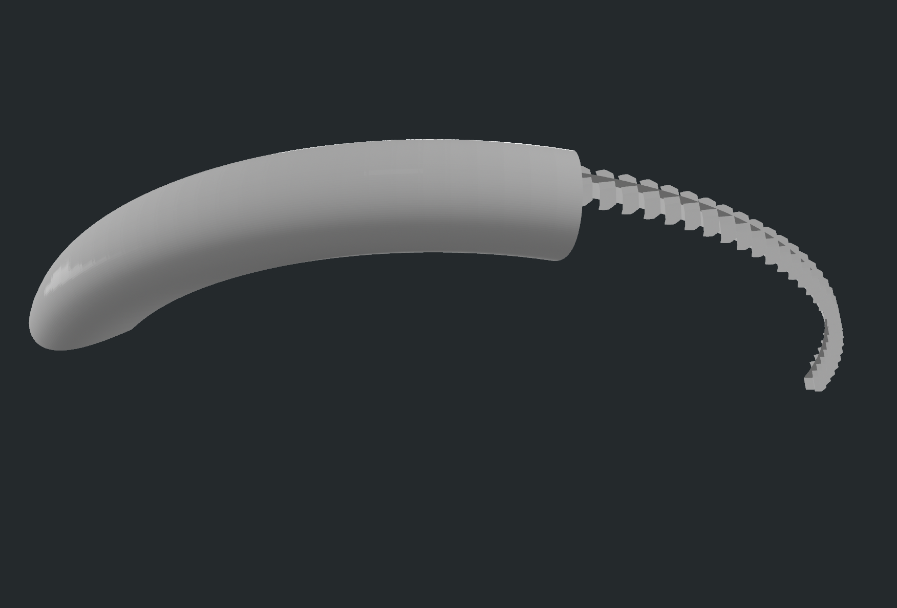
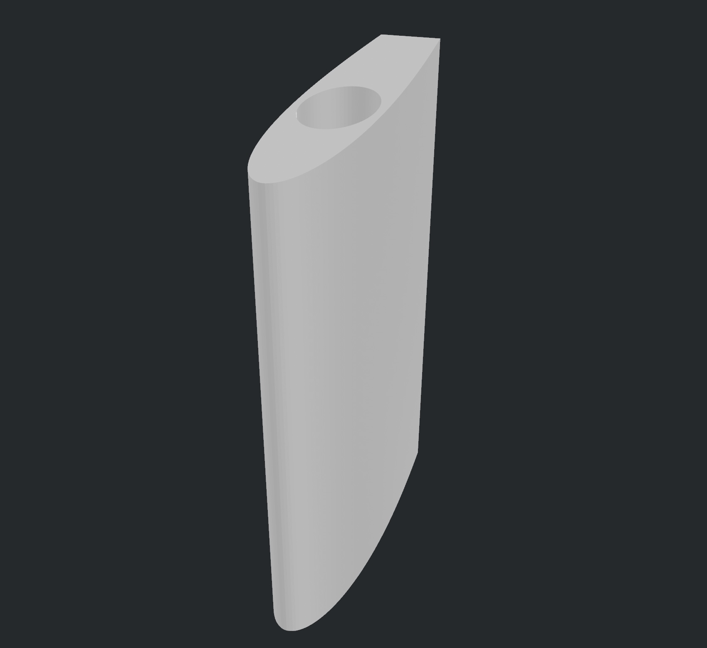
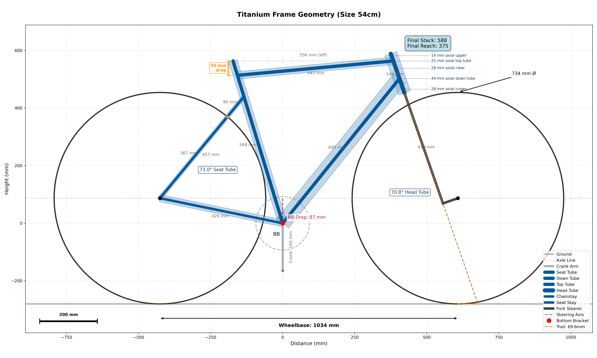

# catlin_bicycle
Assorted cycling related, mostly aerodynamics related

## Aerodynamic Fender/Mudguard
Code that can dynamically generate an advanced, aerodynamic fender/mudguard for a bicycle.

## Seatpost Fairing
Designed to be 3D printed, to make practical round seat posts to be more aerodynamic. Script can be run to create different sizes easily.

## Titanium Frame Geometry
Designed to create specs for a custom titanium frame

